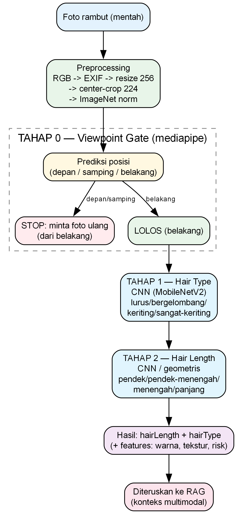
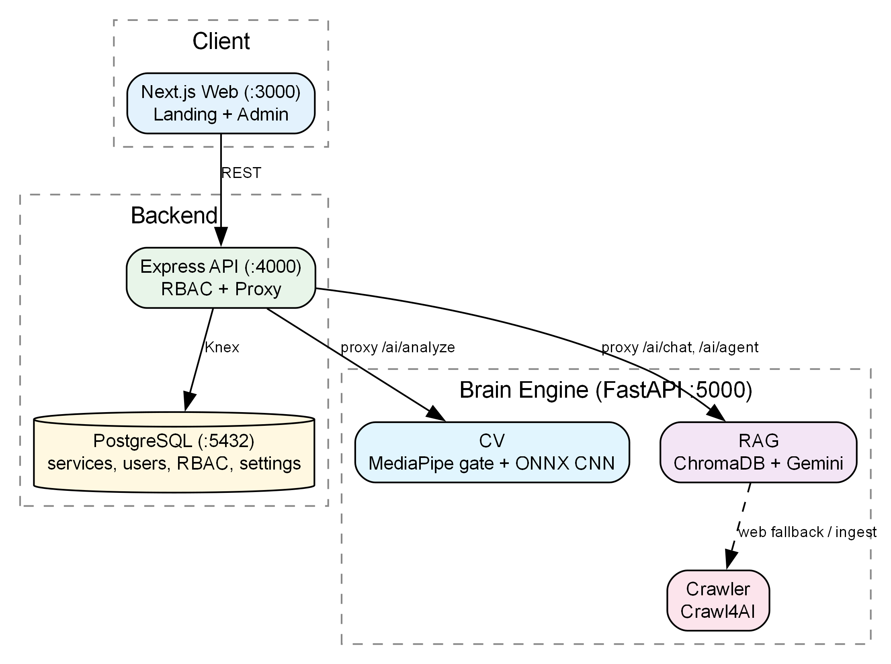
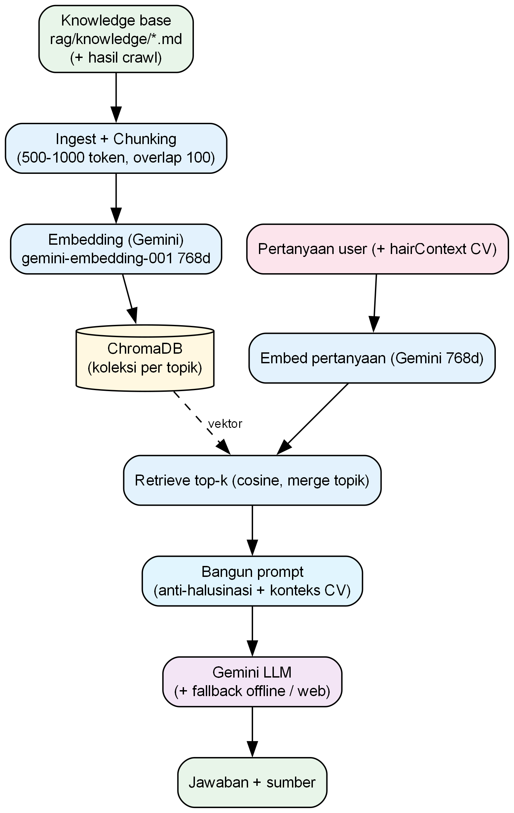
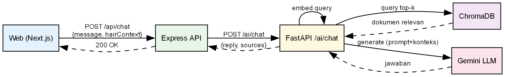
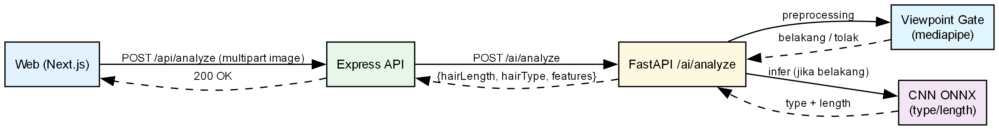

# 09 — Analisis CV & RAG (Bahan Bimbingan TA)

> Dokumen ini merangkum **kondisi teknis Computer Vision (CV) & RAG** pada project ini untuk
> keperluan bimbingan TA: pipeline, dataset, preprocessing, training, **metrik uji**, **kendala**,
> dan **rekomendasi**. Penekanan pada **CV**; RAG dibahas ringkas.
>
> Diagram: [`docs/diagrams/`](diagrams/) — **flowchart CV**, **flowchart RAG**,
> **sequence chat RAG**, **sequence analisis foto CV**, **arsitektur sistem**.











---

## A. RINGKASAN EKSEKUTIF

| Komponen | Status | Metrik utama |
|---|---|---|
| **Viewpoint gate** (depan/samping/belakang, mediapipe) | Aktif, heuristik | Akurasi **80.3%** (n=193; 83.8% di luar ragu) |
| **Hair type** (lurus/bergelombang/keriting/sangat-keriting, CNN) | Terlatih | Akurasi **92.3%** (puncak hold-out), macro-F1 **0.61** ⚠️ |
| **Hair length** (geometris) | Terlatih | Akurasi **54.2%**, macro-F1 **0.50** |
| **Hair length** (CNN/EfficientNetV2-S, hold-out asli) | Terlatih | Akurasi **85.5%**, macro-F1 **0.80** |
| **RAG** (ChromaDB + Gemini) | Aktif | Faithfulness 0.50, Context Recall 1.0 (n=1, pilot) |

> ⚠️ **Update (retrain dataset 252 terkurasi).** Hair type dilatih ulang pada dataset Figaro-1k
> hasil kurasi manual (**252 gambar**; 600→252 setelah pembersihan) dan dievaluasi pada **hold-out
> asli** `preprocessed/val/` (n=52). Akurasi global **naik** (84.2% → **92.3%**), membuktikan
> *data bersih > data banyak*. **Namun** kelas `sangat-keriting` tersisa hanya **5 gambar**
> (val=1) sehingga tidak terwakili → **macro-F1 turun 0.77 → 0.61**. Lihat §B.5 dan §B.8.

**Kendala utama (untuk konsul dosen):**
1. **Kualitas & keseimbangan dataset** — bukan arsitektur (terbukti: backbone benchmark 15 model
   hanya beda tipis; data bersih mengalahkan data banyak).
2. **Kelas ambigu & kelas minoritas** — `bergelombang` vs `keriting` vs `sangat-keriting` tumpang
   tindih; setelah kurasi, `sangat-keriting` hanya 5 gambar → kelas praktis hilang.
3. **Viewpoint / pose detection** — MediaPipe gagal deteksi pose pada 36% foto back-view → gate
   Fase 0 **kondisional**.

---

## B. COMPUTER VISION (DETAIL)

### B.1 Pipeline (modular)

Kode: `apps/api/cv/` — modular per tahap.

```
Foto user (mentah)
   ↓
[ common/ ]      preprocessing + constants + io
   ↓
[ viewpoint/ ]   TAHAP 0 — GATE posisi (depan/samping/belakang)
   │              hanya "belakang" diterima (VIEWPOINT_ACCEPTED)
   ├─ depan/samping → STOP ("foto ulang dari belakang")
   └─ belakang → LANJUT
              ↓
[ hair_type/ ]   TAHAP 1 — jenis rambut (4 kelas)
[ hair_length/ ] TAHAP 2 — panjang rambut (4 kelas)
              ↓
[ pipeline/ ]    orkestrasi end-to-end + adaptor ke apps/ai
```

- Label tetap (`common/constants.py`):
  - Viewpoint: `depan`, `samping`, `belakang`.
  - Hair type: `lurus`, `bergelombang`, `keriting`, `sangat-keriting`.
  - Hair length: `pendek`, `pendek-menengah`, `menengah`, `panjang`.

**Catatan:** ada 2 generasi kode —
- **Pipeline modular baru** (`viewpoint/`, `hair_type/`, `hair_length/`, `common/`, `pipeline/`).
- **Warisan** (`scripts/`) — banyak versi eksperimen (train_length_v2..v6, ensemble, dst).

### B.2 Dataset

Lokasi: `apps/api/cv/dataset/`.

| Folder | Kelas | Jumlah gambar | Sumber / catatan |
|---|---|---|---|
| `figaro1k/` | lurus | 89 | Figaro-1k, **hasil kurasi manual** (back-view), 252 gambar total |
| | bergelombang | 86 | |
| | keriting | 72 | |
| | sangat-keriting | **5** ⚠️ | sangat sedikit (kelas praktis hilang) |
| `extra/` | pendek | 990 | data tambahan (timpang), hanya untuk hair_length |
| | pendek-menengah | 570 | |
| | menengah | 150 | |
| | panjang | 240 | |
| `hair_length_geometris/` | (label geometris) | — | hasil labeling geometris |

> **Catatan penting (dataset Figaro):** dataset semula 600 gambar (150/kelas). Pada kurasi manual
> (back-view) disisakan **252 gambar** (89/86/72/**5**); 348 sisanya dibuang karena bukan back-view
> / tidak layak. Konsekuensi: kelas `sangat-keriting` menjadi minoritas ekstrem.
> Tensor `preprocessed/` dibangun ulang dari 252 gambar (**652 tensor**: 600 train + 52 val).

- **Viewpoint**: sebagian foto Figaro sudah dianotasi manual (ground truth `viewpoint_verification_A.json`, n=193) untuk mengukur akurasi gate.
- **Preprocessing tensors**: `preprocessed/`, `preprocessed_length/`, `preprocessed_length_merged/` (`.pt` NCHW).
- **Dataset back-view asli langka di internet umum** → pernah dilakukan harvest (Openverse/HF/Bing/CLIP filter) & anotasi manual. Ini salah satu kendala yang bisa diangkat ke dosen.

### B.3 Preprocessing (`scripts/preprocess.py`)

Pipeline terstandar (RGB, **bukan** grayscale — warna penting untuk salon):

1. Baca **RGB 8-bit sRGB**; `exif_transpose` (auto-orient); tolak jika sisi < 224px.
2. **Resize keep-aspect** sisi pendek → **256**.
3. **Center-crop 224**.
4. `ToTensor` + **Normalize ImageNet** (`mean=[0.485,0.456,0.406]`, `std=[0.229,0.224,0.225]`).
5. Output tensor **NCHW float32 (1,3,224,224)**.

**Augmentasi (hanya train)**: `RandomResizedCrop(scale 0.875–1.0, ratio 3/4–4/3)` +
`RandomHorizontalFlip(0.5)` + `RandomRotation(±10°)`; tiap citra train → `(1 + 2) = 3` versi.
**Val/inference identik tanpa augmentasi** (agar metrik konsisten dengan runtime).

Split: **20% val per kelas**, `seed=42`.

### B.4 Training & Backbone

- **Hair type**: MobileNetV2 (ONNX `hair_type.onnx`).
- **Hair length**: beberapa eksperimen — MobileNetV2, hingga ensemble 3-seed & ConvNeXt-Tiny;
  benchmark 15 backbone → juara `efficientnet_v2_s` (~84%). Model deploy pernah ConvNeXt-Tiny.
- Artefak training: `weights/_train_report_*.json`; benchmark `weights/_bench_backbones.json`.

### B.5 METRIK UJI (angka eksplisit)

**Hair type (FINAL — hold-out asli, notebook `main.ipynb`, dataset 252 terkurasi):**
`preprocessed/val/` (n=52, MobileNetV2, 12 epoch):

| Kelas | Precision | Recall | F1 | Support |
|---|---|---|---|---|
| lurus | 0.783 | 1.000 | 0.878 | 18 |
| **bergelombang** | 0.800 | 0.667 | 0.727 | 18 |
| keriting | 0.857 | 0.800 | 0.828 | 15 |
| **sangat-keriting** | **0.000** ⚠️ | **0.000** | **0.000** | **1** |

- **Akurasi puncak 0.9231** (@ep3), akurasi akhir 0.8077, **macro-F1 0.6082**.
- **Gap overfitting akhir +0.189** (train_acc 0.997 vs val_acc 0.808); ECE **0.145** (overconfident).
- **Kelas bermasalah: `sangat-keriting`** (val hanya 1 gambar → F1 0). Kelas terlemah berikutnya
  `bergelombang` (recall 0.667).

> **Perbandingan sebelum/sesudah kurasi** (hold-out):
> | Metrik | Sebelum (600 img) | Sesudah (252 img) |
> |---|---|---|
> | val_acc puncak | 0.8417 | **0.9231** ▲ |
> | macro-F1 | 0.7705 | **0.6082** ▼ |
> | ECE | 0.151 | 0.145 ▲ |
>
> Kesimpulan: **data bersih menaikkan akurasi**, tetapi **jumlah gambar kelas minoritas harus
> dijaga** agar macro-F1 tidak runtuh.

**Hair type (historis)** — `reports/eval_hair_type.json` (val 120, dataset 600):

| Kelas | Precision | Recall | F1 | Support |
|---|---|---|---|---|
| lurus | 0.763 | 0.967 | 0.853 | 30 |
| **bergelombang** | 0.900 | 0.600 | **0.720** | 30 |
| keriting | 0.897 | 0.867 | 0.881 | 30 |
| sangat-keriting | 0.909 | 1.000 | 0.952 | 30 |

- **Accuracy 0.8583**, macro-F1 **0.8517**. **Kelas terlemah: `bergelombang`** (recall 0.60).

**Hair length (geometris)** — `reports/hair_length_comparison.json` (val 120):

| Kelas | F1 | Support |
|---|---|---|
| pendek | 0.656 | 32 |
| **pendek-menengah** | **0.270** | 25 |
| menengah | 0.436 | 31 |
| panjang | 0.644 | 32 |

- **Accuracy 0.5417**, macro-F1 **0.5015**. **Kelas terlemah: `pendek-menengah`**.

**Hair length (CNN/ensemble)** — `reports/hair_length_ensemble.json` (val 250):
- Best **accuracy 0.824** (seed 42; ensemble 3-seed + TTA = 0.824).

**Viewpoint gate** — `viewpoint/reports/viewpoint_accuracy.json` (n=193 vs anotasi manusia):
- **Accuracy 0.8031** (0.8378 tanpa label "ragu"). Per kelas prediksi:
  belakang 0.842, depan 0.732, samping 0.684.

**Analisis separability fitur** — `reports/hair_separability.json` (n=600):
- Fitur paling diskriminatif: **`bbox_aspect`** (F=63.8), lalu `solidity` (F=18.0).
- Namun **keriting vs sangat-keriting hanya ~63–67%** dengan threshold tunggal → **bukti kelas ambigu**.

### B.6 KENDALA (siap disampaikan ke dosen)

1. **Dataset quality > quantity.**
   Uji: model dilatih pada data manual-verified (bersih) mengalahkan model pada data besar
   namun noisy. Backbone benchmark (15 model) hanya beda tipis → **bottleneck = data**, bukan arsitektur.
   *Konfirmasi terbaru:* kurasi 600→252 menaikkan akurasi hair_type 84%→92%.
2. **Kelas ambigu & minoritas.**
   `bergelombang↔keriting↔sangat-keriting` (F1 bergelombang 0.72; separability ~0.63–0.67);
   `pendek-menengah` (F1 0.27) — batas panjang sulit. Setelah kurasi, **`sangat-keriting` hanya
   5 gambar** → **F1 0** (macro-F1 turun ke 0.61) — bukti keseimbangan kelas wajib dijaga.
3. **Gate viewpoint / pose.**
   Fase 0 **KONDISIONAL**: pose terdeteksi hanya **64%** pada back-view; 16/44 `no_pose`.
   Di antara yang terdeteksi, landmark andal (shoulder 96%, head 100%). Model heavy tidak membantu.
   Dugaan akar: anotasi viewpoint tidak akurat + pose tertutup rambut.
4. **Data back-view asli sulit didapat** dari sumber publik legal → butuh strategi harvest + anotasi.
5. Deployment backbone & metadata label sempat tidak sinkron (sudah diperbaiki).

### B.7 REKOMENDASI (usulan untuk TA)

- **Data**: prioritaskan **anotasi manual & keseimbangan kelas**; tambah dataset back-view
  spesifik (Figaro-1k dipertahankan sebagai core + augmentasi terarah); buang `no_pose` untuk
  Fase 1.
- **Model**: pertimbangkan **fine-grained** & **hierarkis** (type → length/ketebalan), atau
  segmentasi (UNet) sebelum klasifikasi untuk memisahkan rambut dari latar.
- **Evaluasi**: laporkan **macro-F1 + confusion matrix** (bukan hanya accuracy), plus
  **kalibrasi** (ECE) untuk keandalan.
- **Viewpoint**: gate hybrid (heuristik + CNN kecil) atau perbaiki anotasi viewpoint.
- **Kontribusi**: bangun **dataset back-view salon** (aset orisinal) sebagai nilai jual skripsi.

### B.8 TEMUAN RETRAIN DATASET TERKURASI (252 gambar)

Retrain terakhir (`main.ipynb`, hold-out asli) memperlihatkan **dua temuan penting**:

1. **Data bersih menaikkan akurasi.** Setelah kurasi manual 600→252 (hanya back-view layak),
   akurasi hair_type **naik 84.2% → 92.3%** dan macro-F1 hair_length stabil/naik (0.76→0.80).
   Ini bukti kuat untuk argumen **"Quality > Quantity"**.

2. **Tetapi keseimbangan kelas tetap krusial.** Kelas `sangat-keriting` tinggal **5 gambar**
   (val=1) → **F1 = 0** dan **macro-F1 turun 0.77 → 0.61**. Overfitting makin terlihat
   (gap +0.19, akurasi puncak hanya di epoch 3 lalu menurun).

**Implikasi untuk TA:**
- Angka yang **layak dilaporkan**: akurasi global **~92%** (hair type) & **~85%** (hair length),
  dengan **catatan jujur** bahwa macro-F1 turun karena kelas minoritas.
- **Rekomendasi langsung**: tambah data `sangat-keriting` (minimal ~30–50 gambar) atau gabungkan
  kelas ini, agar 4 kelas tetap valid; pertimbangkan **class-weight** & **stratified hold-out**.

---

## C. RAG (RINGKAS)

Kode: `apps/ai/app/rag/`.

**Alur:** `ingest` (chunk 500–1000 token, overlap 100) → `embed` (Gemini `gemini-embedding-001`
768d) → `vector_store` (ChromaDB, koleksi per-topik) → `retriever` (cosine, merge) →
`prompt_builder` (anti-halusinasi) → `rag_service` (Gemini LLM + fallback offline + web fallback).

**Jembatan CV → RAG (nilai multimodal):** hasil CV (`hairLength`, `hairType`, `hairFeatures`)
disuntikkan ke prompt RAG agar rekomendasi & estimasi harga sesuai kondisi rambut pengguna.
Agent admin: `agent_service.py` + `agent_tools.py` (function-calling: layanan/pemasukan/reservasi).

**Evaluasi:** `apps/ai/app/rag/eval_rag.py` + `apps/ai/rag/eval/` (testset + ragas report).
Metrik LLM-as-judge (pilot n=1): Faithfulness 0.50, Answer Relevancy 0.00, Context Precision 0.50,
Context Recall 1.00.

**Kendala RAG:** testset masih sangat kecil (n=1) → perlu diperbesar; relevansi jawaban perlu
ditingkatkan; `GEMINI_API_KEY` & latensi eksternal.

---

## D. FILE KODE TERKAIT

### CV (`apps/api/cv/`)
| Path | Peran |
|---|---|
| `common/constants.py` | Label tetap, path, normalisasi ImageNet |
| `common/io_utils.py`, `common/preprocess.py` | IO & preprocessing bersama |
| `viewpoint/gate.py` | Gate posisi (mediapipe) |
| `viewpoint/verify.py`, `measure.py`, `pose_check.py` | Verifikasi & pengukuran gate |
| `viewpoint/train_cnn.py`, `evaluate.py`, `build_dataset.py` | CNN viewpoint + evaluasi |
| `viewpoint/clean_annotation.py`, `apply_clean.py`, `filter_harvested.py` | Cleaning dataset & anotasi |
| `viewpoint/clip_filter.py` | Filter semantic (CLIP) untuk harvest |
| `hair_type/train.py`, `evaluate.py`, `labels.py` | Klasifikasi jenis rambut |
| `hair_length/train.py`, `evaluate.py`, `bench_backbones.py` | Klasifikasi panjang + benchmark |
| `pipeline/run.py`, `pipeline/adapters.py` | Orkestrasi end-to-end + adaptor apps/ai |
| `scripts/preprocess.py` | Preprocessing → tensor NCHW |
| `scripts/export_to_onnx*.py`, `evaluate_onnx.py` | Ekspor & evaluasi ONNX |
| `reports/*.json` | **Metrik uji** (eval_hair_type, hair_length_comparison, hair_separability, dll) |
| `weights/*.onnx|*.pth` | Model terlatih |
| `dataset/` | Dataset mentah |
| `preprocessed*/` | Tensor hasil preprocessing |

### RAG (`apps/ai/app/rag/`)
| Path | Peran |
|---|---|
| `ingest.py`, `chunker.py` | Ingest & chunking dokumen `.md` |
| `embedding.py` | Embedding Gemini 768d (+ fallback lokal) |
| `vector_store.py` | ChromaDB (persistent/http) |
| `retriever.py`, `prompt_builder.py` | Retrieval & penyusunan prompt |
| `rag_service.py`, `web_fallback.py` | LLM + fallback web |
| `agent_service.py`, `agent_tools.py`, `api_client.py` | Agent admin (tool-calling) |
| `db_serializer.py`, `sync_catalog.py` | Serialize DB → ChromaDB |
| `eval_rag.py` | Evaluasi RAG (LLM-as-judge) |
| `rag/eval/` | Testset & ragas report |

### Backend/runtime terkait CV
| Path | Peran |
|---|---|
| `apps/ai/app/routers/analyze.py` | `POST /ai/analyze` (CV runtime) |
| `apps/ai/app/routers/chat.py`, `agent.py` | `POST /ai/chat`, `/ai/agent` (RAG) |
| `apps/api/src/controllers/*` | Proxy API & ringkasan data |

---

## E. PERTANYAAN UNTUK DOSEN PEMBIMBING

1. Apakah **kontribusi dataset back-view salon** (anotasi orisinal) cukup sebagai novelty,
   di samping model klasifikasi?
2. Batas minimal **metrik uji** yang diharapkan (macro-F1? per-kelas?) untuk skripsi.
3. Arah perbaikan prioritas: **perbaiki gate viewpoint** atau **fokus hair type/length**?
4. Apakah pendekatan **hierarkis (type → length/volume)** disetujui sebagai arsitektur final?
5. Perlukah **segmentasi rambut (UNet)** atau cukup klasifikasi CNN end-to-end?
